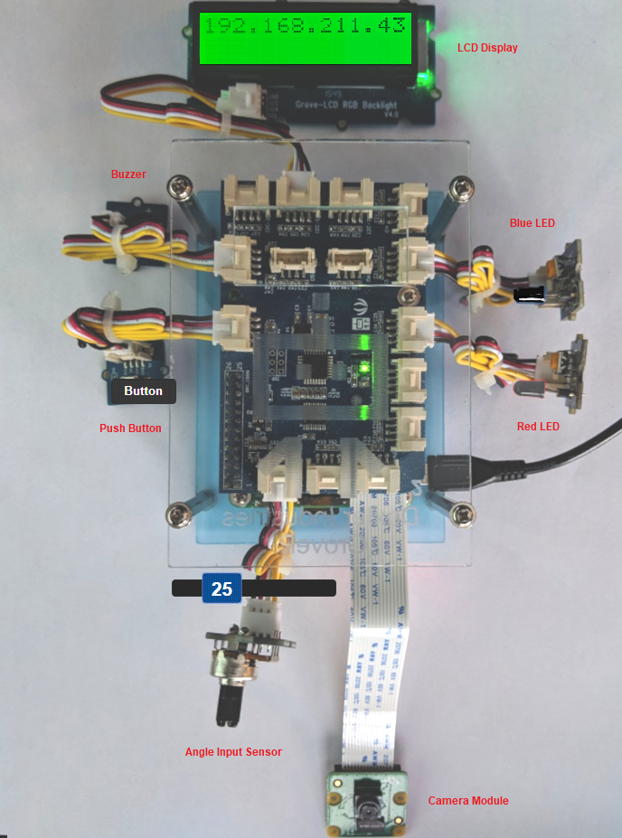

# IoT Core Workshop Device Simulator

The following provides a device simulator for use with the AWS IoT Core Workshop. It is intended for use in the absense of physical hardare used by that workshop. Refer to the **[AWS IoT Core Workshop](https://github.com/joeireland/iot-core-workshop)** for details.

In order to execute the device simulator clone the repo and do the following:

<pre>
cd iot-core-device-simulator
npm install
node index.js
</pre>

Once launched, use your web browser and open the simulator at http://IP-ADDRESS-OF-MACHINE:8080. When loaded you will see a screen similar to the one shown below. The device simulator uses speakers of the system running the web browser to simulate the buzzer. Please ensue your volume is audible and not muted when testing.

